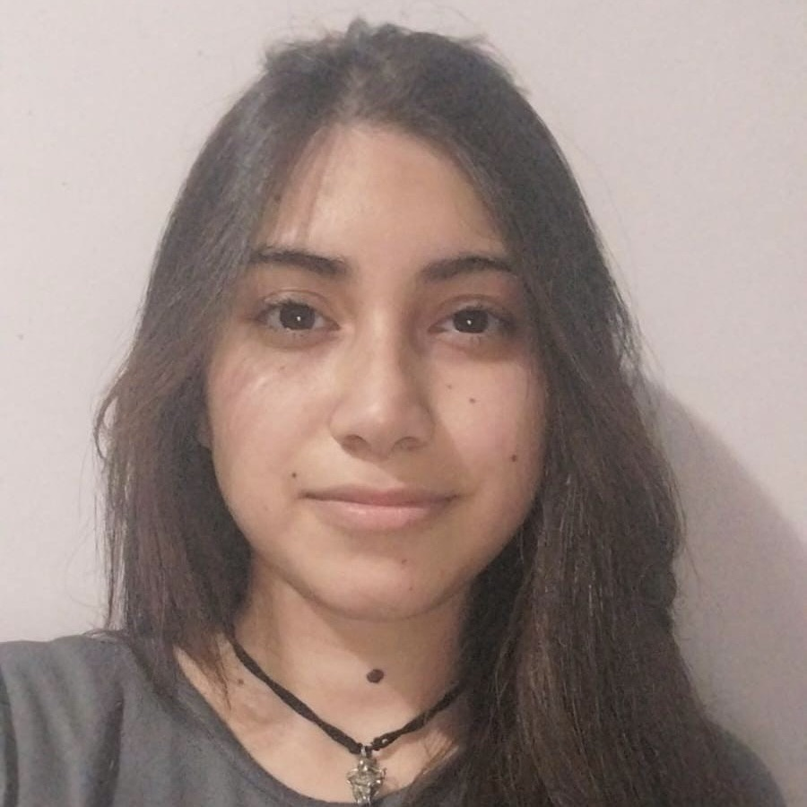
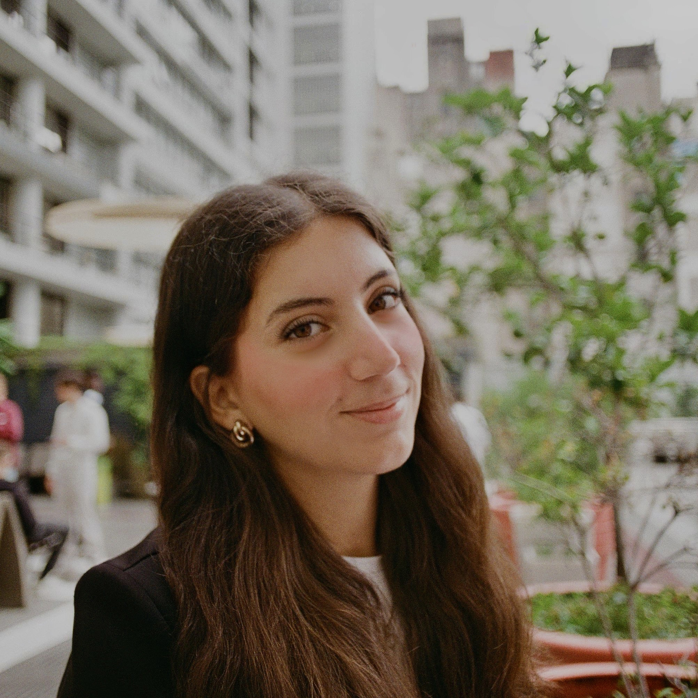
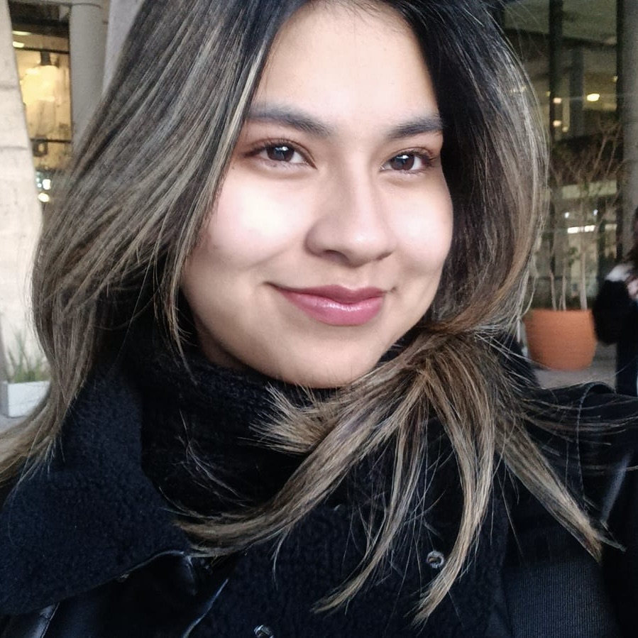
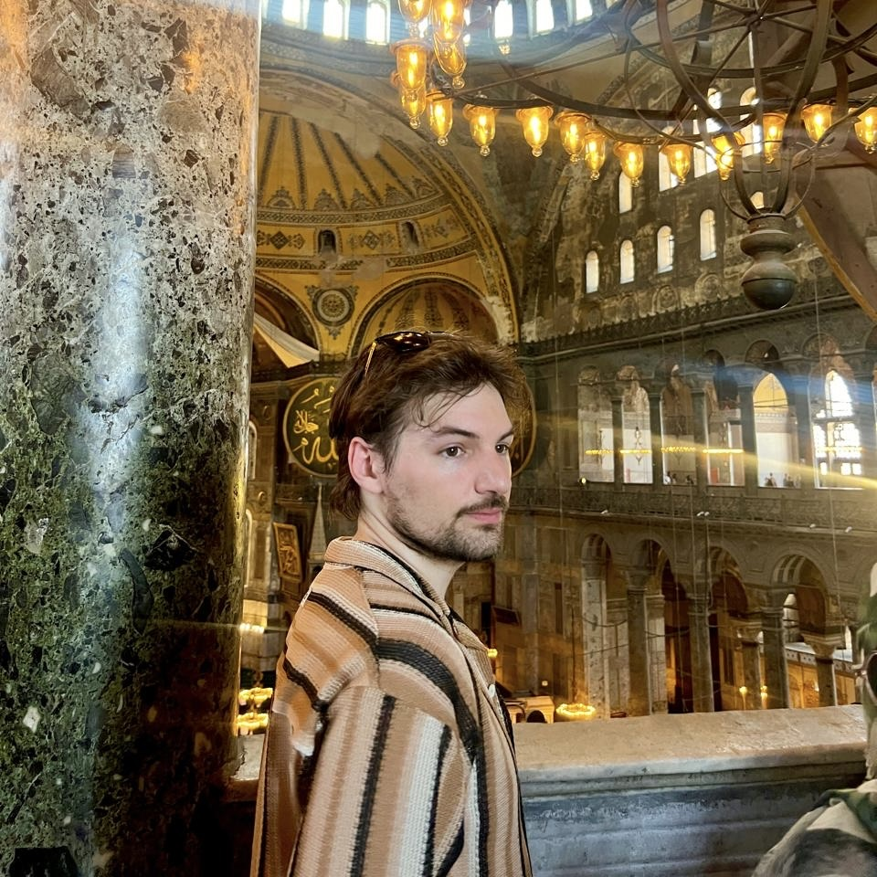

# Polimorfistas
Repositorio de trabajo grupal - Programacion 2 - 2C de 2026

# Integrantes

<table>
  <tr>
    <td width="30%" align="center" valign="top">
      
    </td>
    <td width="70%" valign="top">
      <h3>Sobre mí</h3>
      
Hola, soy Agostina Cerliani, tengo 20 años y soy estudiante de UADE.

      
Actualmente, mi objetivo es comenzar mi carrera profesional en ingenieria en informatica.

      
Mi hobby principal es la fotografia y su edicion .

      
Mis expectativas son absorber conocimientos y potenciar un desarrollo colaborativo para mi crecimiento profesional 

    </td>
  </tr>
</table>

<table>
  <tr>
    <td width="30%" align="center" valign="top">
      
    </td>
    <td width="70%" valign="top">
      <h3>Sobre mí</h3>
      
Hola, soy Valentina Testone, tengo 21 años y soy estudiante de UADE.

      
Actualmente, mi objetivo es seguir nutriendo mis conocimientos sobre la carrera de ingenieria en informatica para poder desenvolverme en el ambito profesional.

      
Mi hobby principal es el deporte.

    </td>
  </tr>
</table>

<table>
  <tr>
    <td width="30%" align="center" valign="top">
      
    </td>
    <td width="70%" valign="top">
      <h3>Sobre mí</h3>
      
Hola, soy Candela Nuñez, tengo 19 años y soy estudiante de UADE.

      
Actualmente, mi objetivo es aprender cada vez mas, mejorar con la practica, alcanzar nuevas metas y adquirir conocimientos para mi carrera profesional.

      
Mi hobby principal es la musica.

    </td>
  </tr>
</table>

<table>
  <tr>
    <td width="30%" align="center" valign="top">
      
    </td>
    <td width="70%" valign="top">
      <h3>Sobre mí</h3>
      
Hola, soy Martina Britez, tengo 19 años y soy estudiante de UADE.

      
Actualmente, mi objetivo es expandir mis conocimientos tecnicos, aprender buenas practicas de desarrollo y ganar experiencia.

      
Mi hobby principal es el gimnasio y los videojuegos.

    </td>
  </tr>
</table>

<table>
  <tr>
    <td width="30%" align="center" valign="top">
      
    </td>
    <td width="70%" valign="top">
      <h3>Sobre mí</h3>
      
Hola, soy Thomas Antonijevic, tengo 26 años y soy estudiante de UADE.

      
Trabajé durante 3 años en desarrollo web Full-Stack, y otros 2 como Arquitecto de Preventa para SNP en proyectos de migraciones y desarrollos SAP. Mi objetivo es utilizar mi experiencia para poder recibirme y ejercer como Project Lead en la industria de videojuegos.

      
Mi hobby principal es competir en videojuegos, tambien soy fan de Game of Thrones y pasar tiempo con mis gatas.

    </td>
  </tr>
</table>

<table>
  <tr>
    <td width="30%" align="center" valign="top">
      
    </td>
    <td width="70%" valign="top">
      <h3>Sobre mí</h3>
      
Hola, soy Julieta Callejon, tengo 19 años y soy estudiante de UADE.

      
Actualmente, mi objetivo es seguir avanzando en la carrera de ingeniería en informática y adquirir conocimientos para insertarme en el mercado laboral.

      
Mis hobbies principales son la música y el teatro.

    </td>
  </tr>
</table>
<table>
  <tr>
    <td width="30%" align="center" valign="top">
      
    </td>
    <td width="70%" valign="top">
      <h3>Sobre mí</h3>
      
Hola, mi nombre es Camila Aguilera. Tengo 19 años y soy estudiante de <b>Ingeniería Informática</b> en UADE.

      
Mis hobbies son los <b>VideoJuegos</b> (en especial Valorant) y la <b>música</b>.

    </td>
  </tr>
</table>

# Bitacora 

### 13/08 - Ejercicios integradores.pdf 

- Se realizo el ejercicio 1 - Clase Producto: atributos, constructor e impresion
- Ejercicio 2 - Consultar y modificar el stock
- Ejercicio 3 - Vender un producto: metodos con condicionales